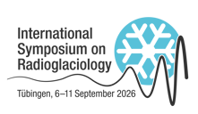
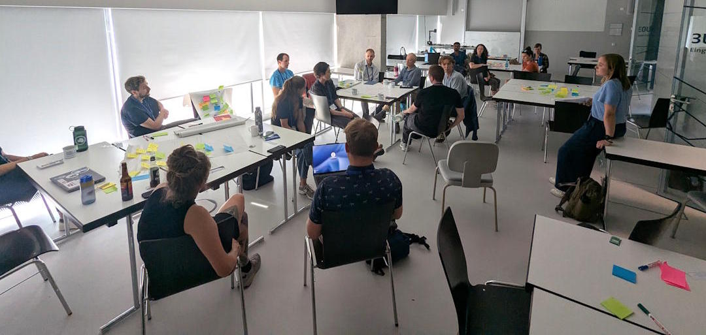
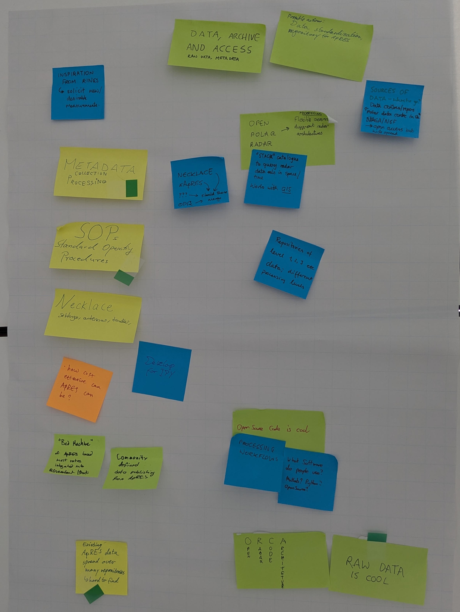
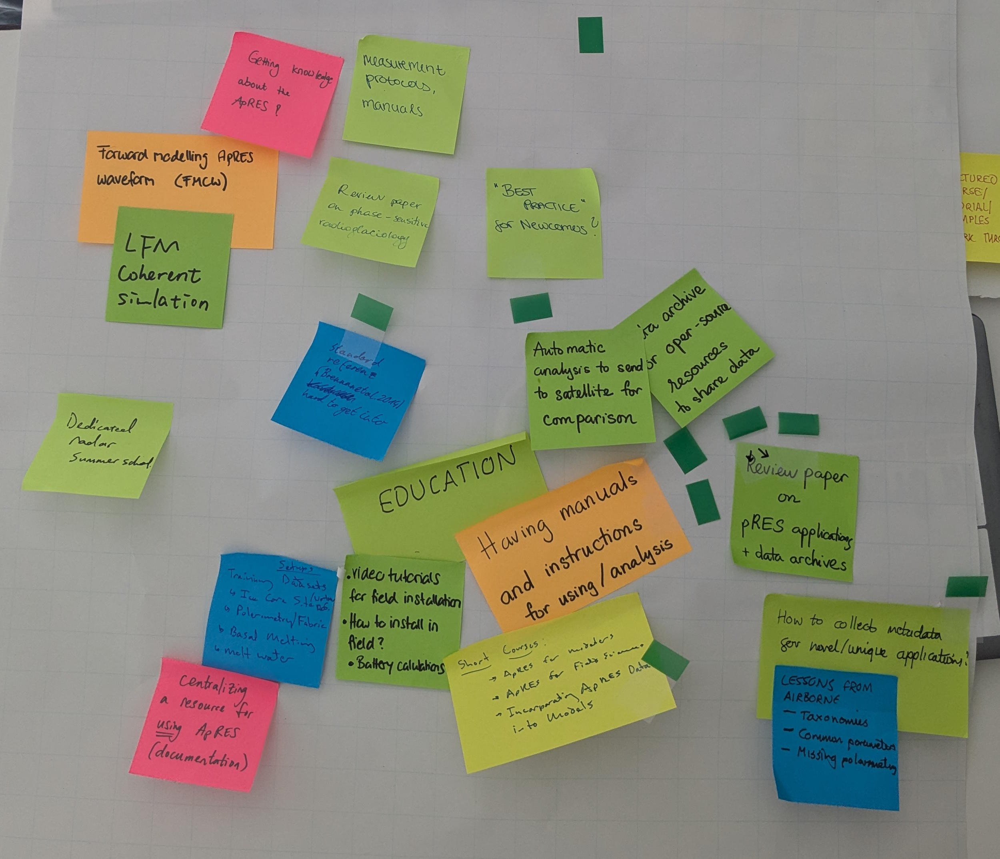
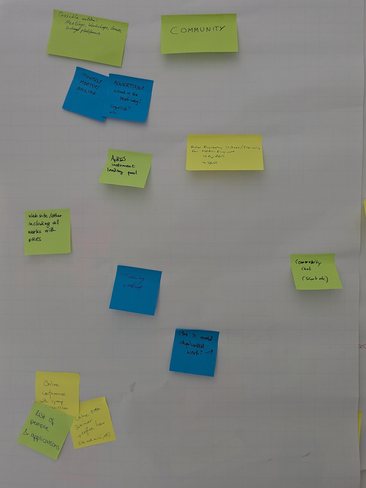
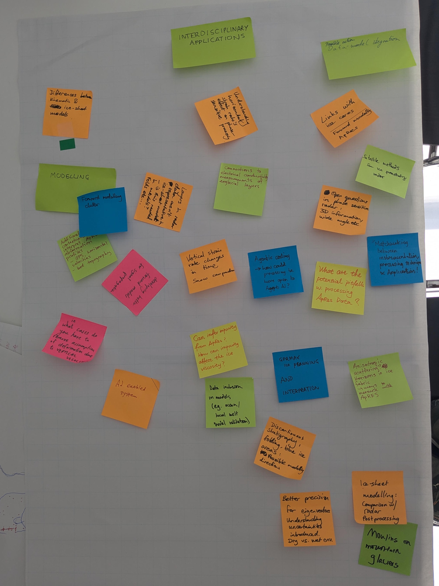
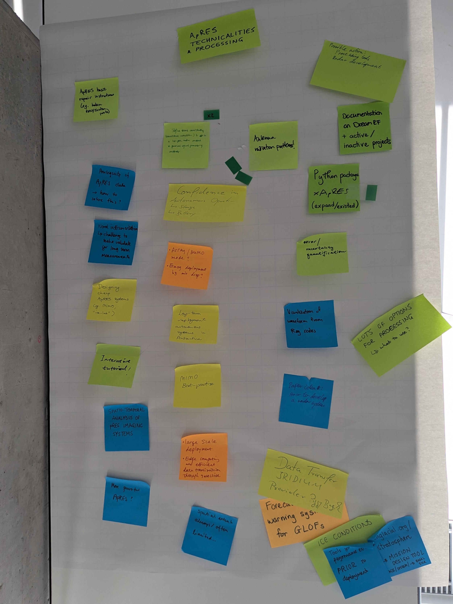
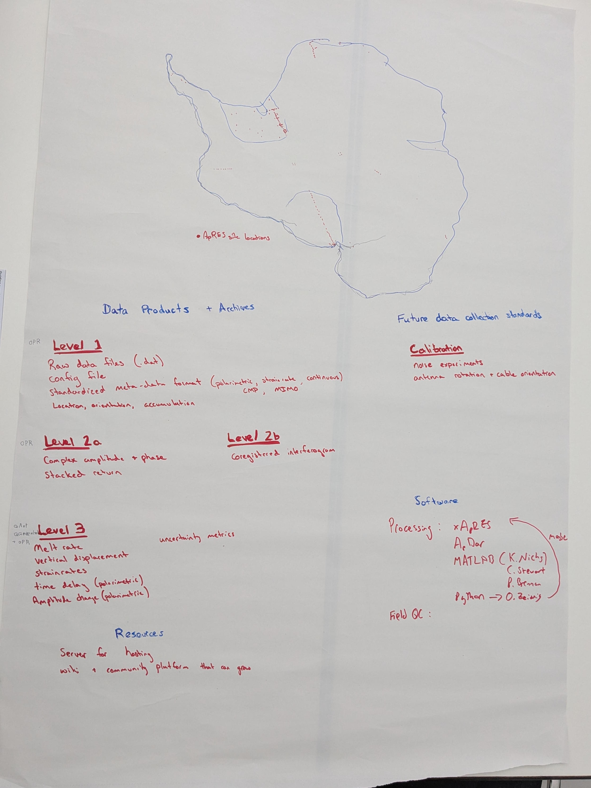
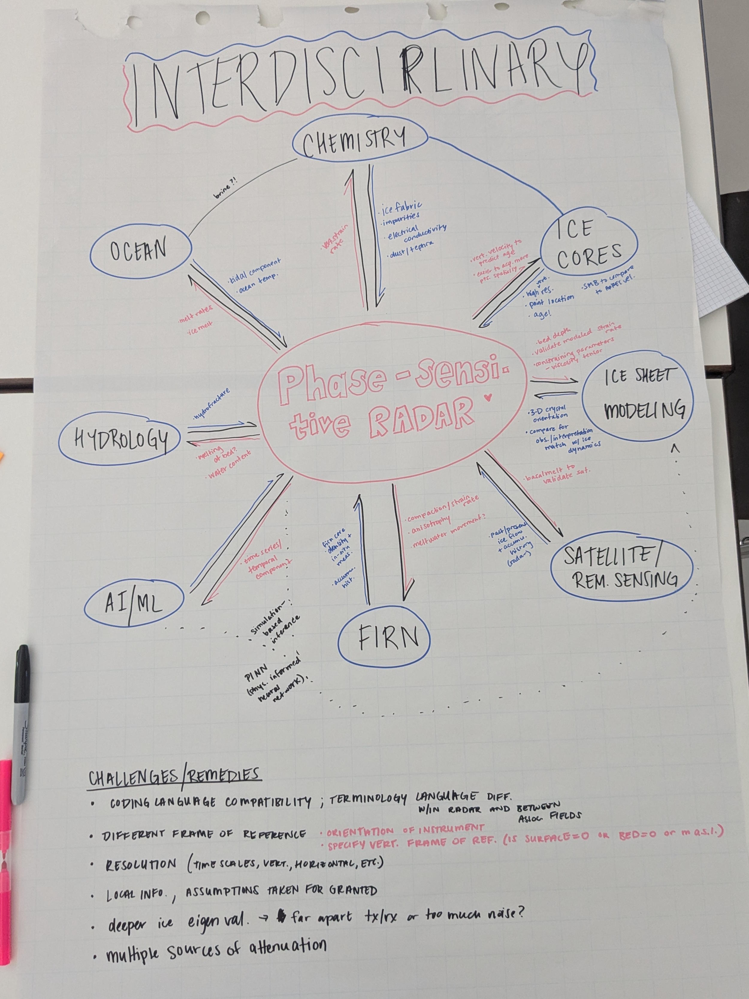

# IGS Radioglaciology 2026

Ahead of the [International Glaciology Society](igs)'s 2026 symposium on [radioglaciology](radioglac-2026), a series of workshops were hosted to engage members of the Radioglaciology community on the topics of software-defined radar, machine learning and phase-sensitive radar. It was great to have so many people (30+) turn up for the *Phase-sensitive radar workshop* which ran all day on Sunday 6th September - particularly given the great weather that T&uuml;bingen had to offer that day!

The workshop was built around facilitating discussion between users of phase-sensitive (coherent) radar systems in glaciology - beginners and experienced alike. The objective of the workshop was to encourage engagement from users of different radar platforms (airborne, space and ground-based). We kicked off the day with a round of introductions and it was great to see satellite SAR and airborne radar communities represented amongst ApRES users.

This report provides the agenda that was followed for the day, along with summarised outcomes from discussions and raw materials generated by the workshop participants during the day.

## Agenda

| Time      | Theme          | Activity                                                                                                                                                                                                  |
| :-------- | :------------- | :-------------------------------------------------------------------------------------------------------------------------------------------------------------------------------------------------------- |
| 09:00     | Welcome        | Introduction from organizer(s)                                                                                                                                                                            |
| 09:10     | Community      | Attendee introductions — two minutes (slides) per person on interests and background                                                                                                                      |
| 10:00     | Community      | Networking (and extra time for introductions).                                                                                                                                                            |
| **10:30** | -              | Coffee break                                                                                                                                                                                              |
| 11:00     | Identify needs | Idea generation and discussion: "What can help you and others better utilize phase-sensitive radar?".                                                                                                     |
| **12:00** | -              | Lunch break: organizers synthesize ideas into four afternoon topics                                                                                                                                       |
| 13:00     | Education      | Presentations on community/open efforts (e.g., xApRES, NECKLACE, AntInSync, model-data integration intro (15 mins, modelling intro, explanation of outputs, data integration, what data is needed etc.)). |
| 13:45     | Outputs        | Discussion group on prescribed afternoon topics (from sticky notes).                                                                                                                                      |
| **14:30** | -              | Coffee break                                                                                                                                                                                              |
| 14:45     | Outputs        | Discussion group on prescribed afternoon topics (from sticky notes).                                                                                                                                      |
| 16:00     | Closing        | Summary of break out groups and planning for next steps as a whole group discussion.                                                                                                                      |

## Discussion
After the morning breakout session, we identified five key themes within which we could categorise the comments and ideas attendees had identified during the morning. These themes were:

* **Data archive and access**: facilitating distribute and accessibility of ApRES datasets.
* **Education**: developing and sharing knowledge around the ApRES instrument and applications.
* **Community**: building a network of users to share knowledge and develop best practices.
* **Interdisciplinary applications**: using ApRES in other fields (modelling, operations) and vice versa.
* **ApRES technicalities**: problems and open questions specifically related to the ApRES instrument.

Each group was given a set of guiding questions to consolidate the information from breakout groups into a more comprehensive poster:

* What has been done before on this topic?
* What is the scientific benefit? What do we want to measure?
* How does this bring the field forward? What would the impact be?
* What are the challenges and how can they be overcome?
* What can we learn from adjacent fields and how can we contribute to them?

## Outcomes

### Data archive and access
[To be completed - Ole Zeising?]

### Education and community
There are several existing resources that currently exist to educate users on ApRES:

* ApRES manuals (available from [DreamRF](dreamrf-docs])).
* xApRES and ImpDAR processing tutorials.
* Papers (Brennan et al., 2014) and theses.
* Word of mouth (supervisors, collaborators, etc.).

After some discussion, we identified several "key issues" relating to the themes and *education* and *community*:

* **Findability** (visibility) of educational resources.
* **Starting out** and **accessibility**.
* **Maintenance**.

#### Findability
ApRES beginners highlighted that there isn't a clear set of resources with which to get started on using the instrument and processing datasets. While there are lots of resources available, the different sets of processing scripts and technical depth of documentation can make it difficult to get started.

* Future efforts should build on existing resources, rather than add yet another source.
* We will investigate using **GitHub Issues** as a community problem solving tool, where people can post technical questions and benefit from community input (similar to a bulletin board).
* Collaboration with existing networks of users and DreamRF to centralise information.

#### Accessibility
With resources already available, several comments highlighted a high barrier of entry required for some of the standard reading material. Possible solutions to address this are:

* Publish an “opt-in” list of profiles and email addresses of experienced ApRES uses to seek advice/collaboration opportunities. This would need have a sufficiently unique purpose to be differentiated against an academic search tool (such as Google Scholar). 
* Remotely hosted JupyterHub with xApRES and example data to provide a "getting started" environment for processing datasets.
* Use existing networks of users to raise awareness and seek involvement with education efforts, such as developing new tutorial and documentation material.

#### Maintenance
Ensuring that education resorces remain maintained and updated is a significant challenge - particularly in academic environments. We solutions that require different levels of maintenance to address the need for more educational material

* **Low maintenance**: one-off documentation and “meta-materials” for using ApRES, to get generated in a ‘hackathon’-like session. 
* **Low maintenance (high effort)**: ApRES problems “hackathon” with introductory sessions  and problem solving – requires recipes and a structured course/tutorial in advance.
* **Medium maintenance**: Webinars and online meetings – how often? timezone?
* **High maintenance**: Community chat/forum – issues with moderation. Need to choose a platform (Discord, Slack).
* **High maintenance**: Dedicated “radioglaciology” mailing list – monthly/quarterly bulletins with community material?

### Interdisciplinary applications 
[To be completed - Clara Henry?]

## Posters
Photographs of the posters from the afternoon session are included below. These include all of the post-it notes from the morning session.

| Data archive and access                 | Education                              | Community                              | Interdisciplinary applications                       | ApRES technicalities               |
| :-------------------------------------- | :------------------------------------- | :------------------------------------- | :--------------------------------------------------- | :--------------------------------- |
|              |          |          |              |          |
| [Full size (A)](img//poster_data01.jpg) | [Full size](img//poster_education.jpg) | [Full size](img//poster_community.jpg) | [Full size (A)](img//poster_interdisciplinary01.jpg) | [Full size](img//poster_apres.jpg) |
|              |                                        |                                        |              |                                    |
| [Full size (B)](img//poster_data02.jpg) |                                        |                                        | [Full size (B)](img//poster_interdisciplinary02.jpg) |                                    |

## Post-its
The raw text from individual post-it notes, sorted into categories, is repeated below to make it more easily human and machine readable.

### Data archive and access

* Inspiration from RINGS: solicit new/desirable measurements directly.
* Metadata collection and processing.
* Standard operating procedures.
* NECKLACE: settings, antennas, issues.
* NECKLACE, xAPRES, OPR – should these merge into a single platform?
* Develop platform for International Polar Year (IPY).
* How cost effective can ApRES be?
* “BedMachine” of ApRES basal melt rates integrated into Quantarctica/QGreenland.
* Community defined data publishing for ApRES.
* Existing ApRES data are spread over many repositories – hard to find.
* Raw data is cool!
* ORCA – open radar code architecture.
* Open source code is cool: processing and waveforms, what software to people use – MATLAB, Python, open source?
* Repositories of level 1, 2, 3 etc. data: different processing levels and products (raw, processed, derived).
* “STAC” catalogue to query radar data in space and time – works with GIS!
* Open polar radar – flexible across different radar architectures.
* Sources of data – where to go? Data centres and repositories. Polar Data Centre in the UK, NASA, NSF – open access but wide spread.
* Possible actions: data standardisation, repository for ApRES.
* Automatic analysis to send to satellite for comparison.
* How to collect metadata for novel/unique applications
* Lessons from airborne data:
    * Taxonomies of instrumentation/collection types.
    * Common parameters.
    * How to account for polarimetry.

### Education
* Review paper, teaching material, field protocols.
* Forward modelling ApRES waveform.
* LFM coherent simulation.
* Getting knowledge about the ApRES?
* Measurement protocols, manuals
* Review paper on phase-sensitive radioglaciology.
* “Best practice” for newcomers. 
* Review paper on pRES applications and data archives.
* Having manuals and instructions for use and analysis.
* Short courses:
    * ApRES for modellers.
    * ApRES for field science.
    * Incorporating ApRES data into models.
* Video tutorials for field installation.
* How to install in the field?
* Battery calculations.
* Training datasets:
    * Ice core site
    * Polarimetry/fabric
    * Basal melt
    * Melt water
* Centralising a resource for using ApRES (documentation).
* Dedicated radar summer school
* Standard reference (Brennan et al. 2014) is hard to get into.

### Community
* Possible action: meetings, workshops, classes, exchange platforms.
* Monthly online meeting – what is the best way to advertise: Cryolist?
* Radar engineering videos and training for non-engineers: ApRES, SAR.
* AprES instrument lending pool.
* Website (or similar) including all published works with ApRES. 
* Community chat (Slack, etc.)
* How to avoid duplicated work (code bases, etc.)
* Training workshop.
* Online conference with group discussion.
* Online zoom seminar and coffee hour (like Maths on Ice).
* List of people and applications.

### Interdisciplinary applications

* Difference between kinematic and ice sheet models
* Forward modelling clutter
* Developing better forward models for signal propagation.
* Additional contextual interpretations for ApRES deformation profiles (GPS, horizontal velocities, bed topography).
* In what cases do you have to remove assumption of deformation due to vertical velocity?
* Layers in radar data aren’t representative in ice-sheet models – is this needed in models? Folds etc.
* Discontinuous stratigraphy, folding, blue ice areas: possible modelling directions.
* AI enabled system.
* GPRmax for planning and interpretation. 
* Data inclusion in models (e.g. ocean/basal melt model validation).
* Can infer impurity from ApRES? How can impurity affect ice velocity?
* Understanding horizontal strain rates effect of phase-sensitive processing.
* Connections to electrical conductivity measurements of englacial layers.
* Agentic coding – how can processing be more open to Agent AI.
* Vertical strain rate changes in time – snow compaction processes.
* Links with ice cores – forward modelling.
* Satellite methods for ice penetrating radar.
* Open questions in phase sensitive radar – 3D information, wide angle etc.
* What are the potential pitfalls with processing ApRES data?
* Satellite methods for ice penetrating radar.
* Matchmaking between instrumentation, processing, techniques and application practitioners.
* Anisotropic scattering horizons in ice fabric – ways to measure with ApRES?
* Ice sheet modelling: comparison with radar processing.
* Better precision for eigenvectors: understanding uncertainties introduced of dry vs wet environments.
* Moulins on mountain glaciers.

### ApRES technicalities

* Basic repair instruments (i.e. broken GNSS/Iridium ports, etc.).
* Ambiguity of ApRES data – how to solve this?
* Novel instrumentation – challenges to test and validate for long term measurements.
* Designing cheap ApRES systems for MIMO (“ice-lab”).
* Interactive tutorial.
* Spatio-temporal analysis of pRES imaging systems.
* More power ApRES.
* Spaital extent often or always limited.
* Large scale deployments.
* Edge computing and efficient transmission through satellite portals.
* MIMO best practices.
* Long-term deployment autonomous systems in Antarctica.
* Array/MIMO mode?
* Deployment by air drop?
* Confidence in autonomous operation – storage, battery.
* Antenna radiation pattern availability.
* Documentation on DreamRF and active/inactive projects.
* Python package (xApRES) – expand!
* Error and uncertainty quantification.
* Lots of options for processing – what to use?
* Visualisation of waveforms from “REG” codes.
* Paper idea: how to develop a radar system.
* Data transform by Iridium – provider piggybacking.
* Forecasting and warning systems for GLOFs.
* Tools for performance or deployment planning (i.e. englacial.org/stratosphere mission design tool).

[igs]: https://www.igsoc.org/
[radioglac-2026]: https://radioglaciology2026.guz.uni-tuebingen.de/
[dreamrf-docs]: https://www.ee.ucl.ac.uk/~ucee364/DreamRF/